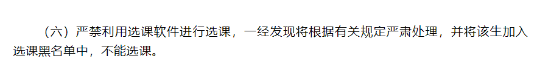

# NKUtakeCourse

适用于本科，在教务系统登录后即可抢课

目前代码仅适用于 专业课、通识选修课 选课界面，若想选别的类型，自行修改url

1. 修改js文件中的lessonNo，为对应课的课程序号

2. 修改js文件中的interval，即抢课时间间隔。

3. F12打开Console控制台，粘贴代码回车

4. start() 开始

在Console输入stop()停止脚本运行

抢到课后请立即停止脚本或刷新。

效果预览

## 注意：概不负责

