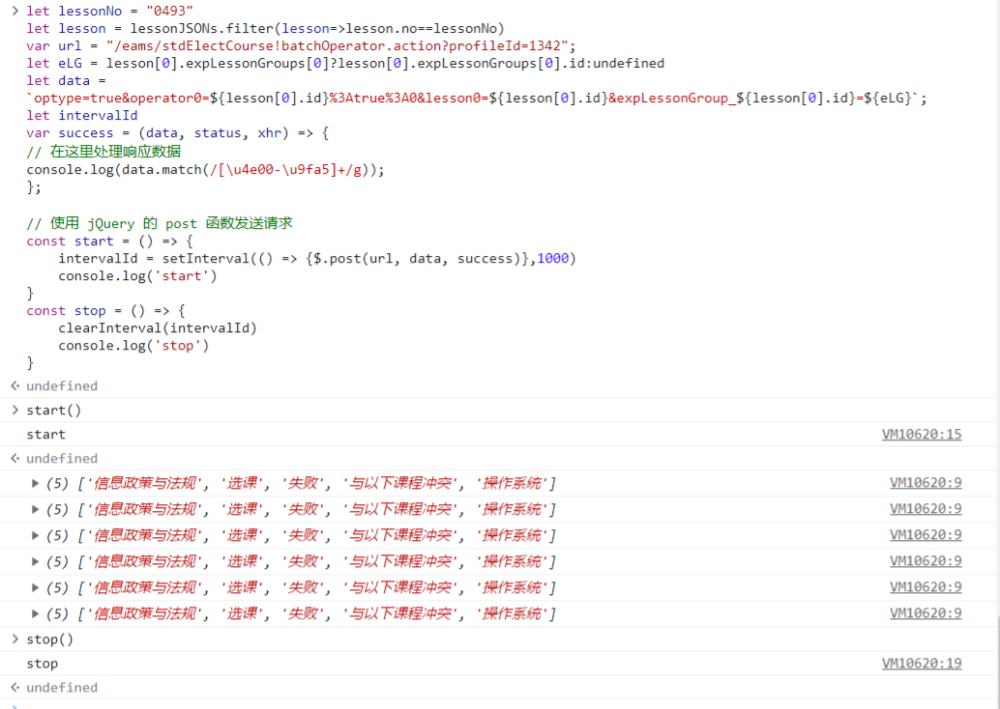

# NKUtakeCourse

南开大学选课js脚本

适用于本科，在教务系统登录后即可抢课

主要实现**选课**和**持续检测是否有余课并选课**两种功能

目前代码url仅适用于 2023秋季补退选第一阶段 选课界面，若想选别的类型，自行修改url

​	1.选课：修改lessonNo为课程序号，适当调整start函数的setinterval参数，粘贴到控制台，start()开始反复选课。stop()停止

​	2.补退选捡漏：修改lessonNo为课程序号，如果该时间段选了另外的课，修改deleteNo为该课序号，否则默认null，也可调整interval，默认两分钟一次检测。粘贴到控制台运行，startCheck()开始检测，将会在有课余时自动退课 然后 选课。stopCheck()停止

抢到课后请立即停止脚本或刷新。

效果预览

最后测试时间：2023.8.30

最后测试时间：2023.8.30

由于南开大学选课网站采取了限制短时间内同一ip的多次请求，所以无法同时选多门课。

其实用处不大

## *注意：概不负责*

